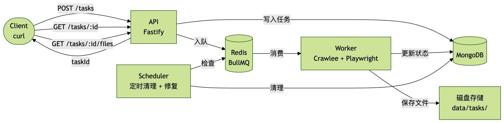
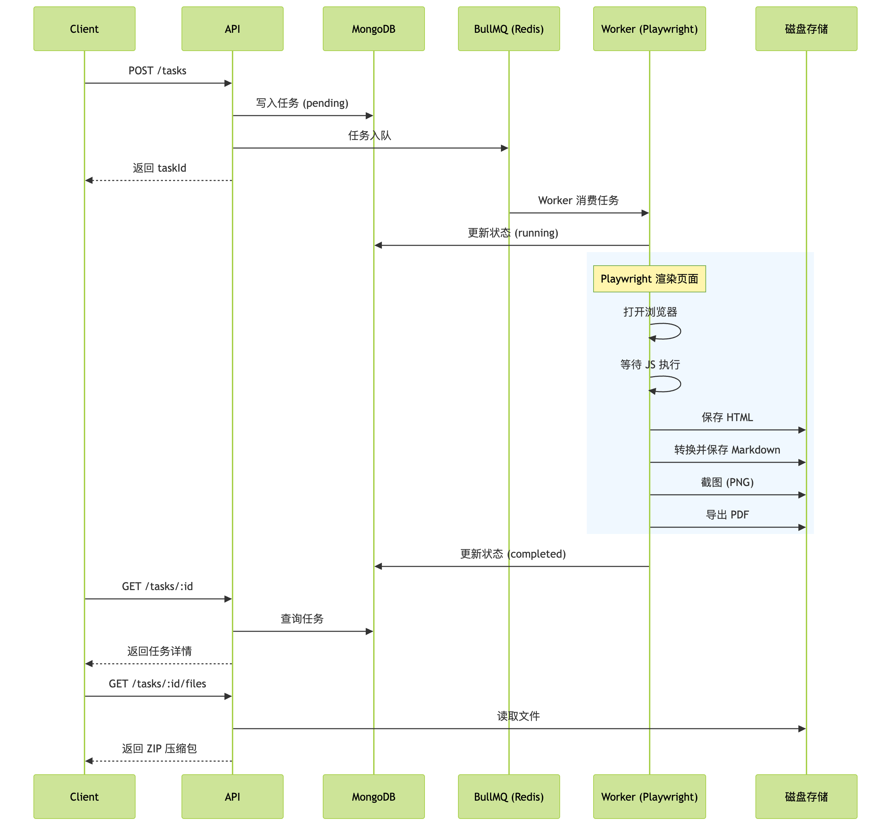
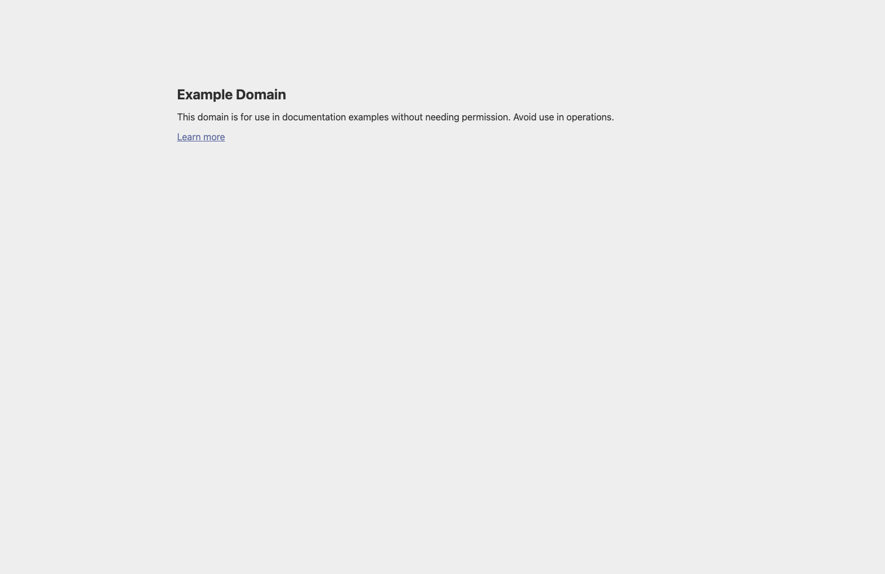
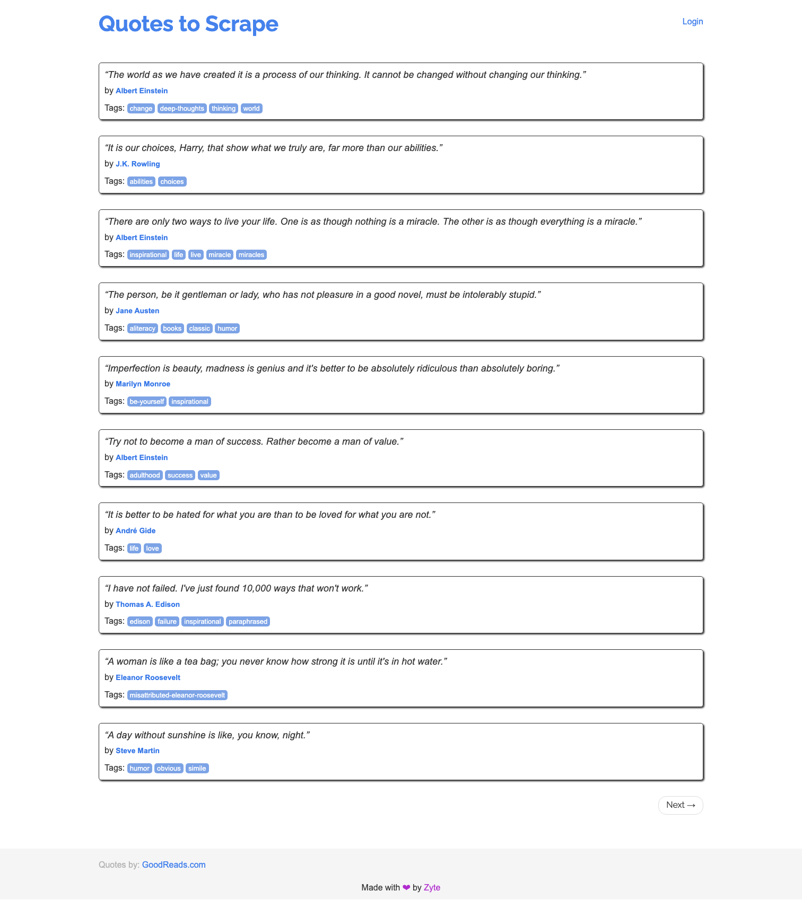

# Trawler 使用示例

> 安装部署与 API 参考请查看 [README.md](README.md)

## 目录

- [架构流程](#架构流程)
- [示例 1：静态页面爬取](#示例-1静态页面爬取)
- [示例 2：动态页面爬取（JS 渲染）](#示例-2动态页面爬取js-渲染)
- [其他常用操作](#其他常用操作)
- [示例产出物](#示例产出物)

---

## 架构流程



**请求生命周期：**



---

## 示例 1：静态页面爬取

> 目标：爬取 `https://example.com`，生成 HTML、Markdown、截图和 PDF。

### 1.1 创建任务

**请求：**

```bash
curl -X POST http://localhost:3000/tasks \
  -H "Content-Type: application/json" \
  -d '{
    "urls": ["https://example.com"],
    "options": {
      "captureScreenshot": true,
      "capturePdf": true
    }
  }'
```

**响应（201）：**

```json
{
    "taskId": "task_1772192029593_77c760fe",
    "status": "pending",
    "urls": [
        "https://example.com"
    ],
    "createdAt": "2026-02-27T11:33:49.595Z"
}
```

### 1.2 查询任务进度

**请求：**

```bash
curl http://localhost:3000/tasks/task_1772192029593_77c760fe/progress
```

**响应（运行中）：**

```json
{
    "taskId": "task_1772192029593_77c760fe",
    "status": "running",
    "progress": {
        "completed": 0,
        "total": 1,
        "failed": 0,
        "currentUrl": "https://example.com"
    }
}
```

### 1.3 查询任务详情

**请求：**

```bash
curl http://localhost:3000/tasks/task_1772192029593_77c760fe
```

**响应（已完成）：**

```json
{
    "taskId": "task_1772192029593_77c760fe",
    "urls": ["https://example.com"],
    "status": "completed",
    "options": {
        "captureScreenshot": true,
        "capturePdf": true
    },
    "progress": {
        "completed": 1,
        "total": 1,
        "failed": 0,
        "currentUrl": "https://example.com"
    },
    "result": {
        "stats": { "success": 1, "failed": 0, "skipped": 0 },
        "files": [
            {
                "type": "html",
                "url": "https://example.com",
                "path": "c984d06aafbecf6bc55569f964148ea3.html",
                "size": 528,
                "mimeType": "text/html"
            },
            {
                "type": "markdown",
                "url": "https://example.com",
                "path": "c984d06aafbecf6bc55569f964148ea3.md",
                "size": 183,
                "mimeType": "text/markdown"
            },
            {
                "type": "screenshot",
                "url": "https://example.com",
                "path": "c984d06aafbecf6bc55569f964148ea3.png",
                "size": 19347,
                "mimeType": "image/png"
            },
            {
                "type": "pdf",
                "url": "https://example.com",
                "path": "c984d06aafbecf6bc55569f964148ea3.pdf",
                "size": 34004,
                "mimeType": "application/pdf"
            }
        ],
        "errors": []
    },
    "createdAt": "2026-02-27T11:33:49.595Z",
    "completedAt": "2026-02-27T11:33:53.652Z"
}
```

### 1.4 产出物

**截图：**



**Markdown 输出：**

```markdown
# Example Domain

This domain is for use in documentation examples without needing permission.
Avoid use in operations.

[Learn more](https://iana.org/domains/example)
```

---

## 示例 2：动态页面爬取（JS 渲染）

> 目标：爬取 `https://quotes.toscrape.com/js/`，页面内容完全由 JavaScript 动态生成。
> 启用递归爬取（`maxDepth: 1`）+ 截图 + PDF，最多 3 页。

### 2.1 创建任务

**请求：**

```bash
curl -X POST http://localhost:3000/tasks \
  -H "Content-Type: application/json" \
  -d '{
    "urls": ["https://quotes.toscrape.com/js/"],
    "options": {
      "captureScreenshot": true,
      "capturePdf": true,
      "maxDepth": 1,
      "maxPages": 3
    }
  }'
```

**响应（201）：**

```json
{
    "taskId": "task_1772174505439_8dc8d52a",
    "status": "pending",
    "urls": [
        "https://quotes.toscrape.com/js/"
    ],
    "createdAt": "2026-02-27T06:41:45.441Z"
}
```

### 2.2 查询任务详情（完成后）

**请求：**

```bash
curl http://localhost:3000/tasks/task_1772174505439_8dc8d52a
```

**响应：**

```json
{
    "taskId": "task_1772174505439_8dc8d52a",
    "urls": ["https://quotes.toscrape.com/js/"],
    "status": "completed",
    "options": {
        "captureScreenshot": true,
        "capturePdf": true,
        "maxDepth": 1,
        "maxPages": 3
    },
    "progress": {
        "completed": 3,
        "total": 3,
        "failed": 0
    },
    "result": {
        "stats": { "success": 3, "failed": 0, "skipped": 0 },
        "files": [
            {
                "type": "html",
                "url": "https://quotes.toscrape.com/js/",
                "path": "0393073fe11a1ef0950253c09b12048a.html",
                "size": 8985,
                "mimeType": "text/html"
            },
            {
                "type": "markdown",
                "url": "https://quotes.toscrape.com/js/",
                "path": "0393073fe11a1ef0950253c09b12048a.md",
                "size": 1753,
                "mimeType": "text/markdown"
            },
            {
                "type": "screenshot",
                "url": "https://quotes.toscrape.com/js/",
                "path": "0393073fe11a1ef0950253c09b12048a.png",
                "size": 171211,
                "mimeType": "image/png"
            },
            {
                "type": "pdf",
                "url": "https://quotes.toscrape.com/js/",
                "path": "0393073fe11a1ef0950253c09b12048a.pdf",
                "size": 106274,
                "mimeType": "application/pdf"
            }
        ],
        "errors": []
    },
    "createdAt": "2026-02-27T06:41:45.441Z",
    "completedAt": "2026-02-27T06:42:22.235Z"
}
```

> 注意：该页面的 HTML 源码中没有引言内容，全部由 `<script>` 动态注入。
> Trawler 使用 Playwright 渲染后才提取内容，因此能正确抓取 JS 生成的数据。

### 2.3 产出物

**截图（JS 渲染完成后的页面）：**



**Markdown 输出（节选）：**

```markdown
# Quotes to Scrape

"The world as we have created it is a process of our thinking.
 It cannot be changed without changing our thinking."
by Albert Einstein

Tags: change deep-thoughts thinking world

"It is our choices, Harry, that show what we truly are,
 far more than our abilities."
by J.K. Rowling

Tags: abilities choices

...（共 10 条引言）
```

---

## 其他常用操作

### 任务列表

```bash
# 分页查询
curl "http://localhost:3000/tasks?limit=5&offset=0"

# 按状态过滤
curl "http://localhost:3000/tasks?status=completed"
```

**响应：**

```json
{
    "tasks": [
        {
            "taskId": "task_1772192029593_77c760fe",
            "urls": ["https://example.com"],
            "status": "completed",
            "progress": { "completed": 1, "total": 1, "failed": 0 },
            "createdAt": "2026-02-27T11:33:49.595Z"
        }
    ],
    "total": 20,
    "limit": 5,
    "offset": 0
}
```

### 文件下载

```bash
# 下载全部文件（ZIP）
curl -O http://localhost:3000/tasks/{taskId}/files

# 按类型过滤
curl -O http://localhost:3000/tasks/{taskId}/files?type=screenshot   # 仅截图
curl -O http://localhost:3000/tasks/{taskId}/files?type=pdf          # 仅 PDF
curl -O http://localhost:3000/tasks/{taskId}/files?type=html         # 仅 HTML
curl -O http://localhost:3000/tasks/{taskId}/files?type=markdown     # 仅 Markdown

# 单文件下载（过滤后仅 1 个文件时可用）
curl -O http://localhost:3000/tasks/{taskId}/files?type=screenshot&format=single
```

### CSS 选择器过滤

```bash
# 只提取 <main> 标签内的内容
curl -X POST http://localhost:3000/tasks \
  -H "Content-Type: application/json" \
  -d '{
    "urls": ["https://example.com"],
    "options": {
      "contentSelector": "main"
    }
  }'

# 多个选择器
curl -X POST http://localhost:3000/tasks \
  -H "Content-Type: application/json" \
  -d '{
    "urls": ["https://example.com"],
    "options": {
      "contentSelector": ["article", ".content", "#main"]
    }
  }'
```

### 取消任务

```bash
curl -X PATCH http://localhost:3000/tasks/{taskId} \
  -H "Content-Type: application/json" \
  -d '{"status": "failed"}'
```

**响应：**

```json
{
    "taskId": "task_xxx",
    "status": "failed",
    "updatedAt": "2026-02-27T12:00:00.000Z"
}
```

### 删除任务

```bash
curl -X DELETE http://localhost:3000/tasks/{taskId}
```

**响应：**

```json
{
    "message": "Task task_xxx deleted successfully"
}
```

### 健康检查与监控

```bash
# 健康检查
curl http://localhost:3000/health

# Prometheus 指标
curl http://localhost:3000/metrics

# 队列统计
curl http://localhost:3000/queue/stats
```

---

## 示例产出物

`example/` 目录包含以下实际爬取产出：

| 文件                                                     | 说明                                    |
| -------------------------------------------------------- | --------------------------------------- |
| [screenshot-static.png](example/screenshot-static.png)   | 静态页面截图（example.com）             |
| [screenshot-dynamic.png](example/screenshot-dynamic.png) | 动态页面截图（quotes.toscrape.com/js/） |
| [output-static.md](example/output-static.md)             | 静态页面 Markdown 转换结果              |
| [output-dynamic.md](example/output-dynamic.md)           | 动态页面 Markdown 转换结果              |
